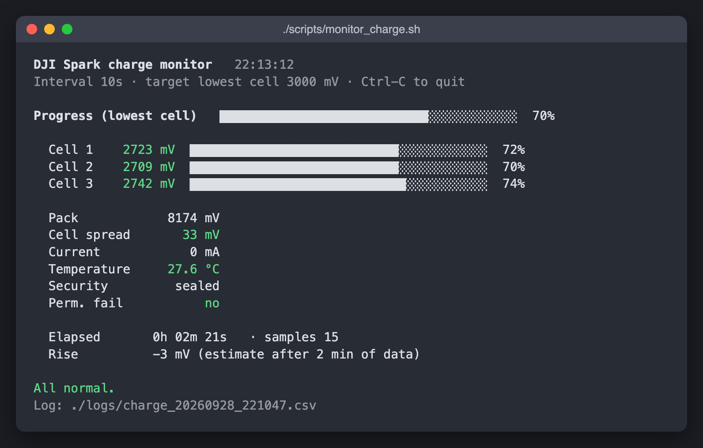
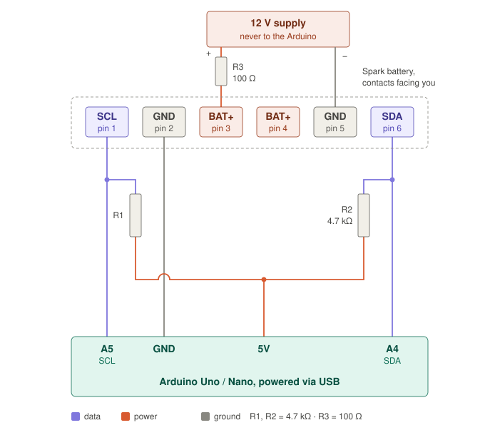
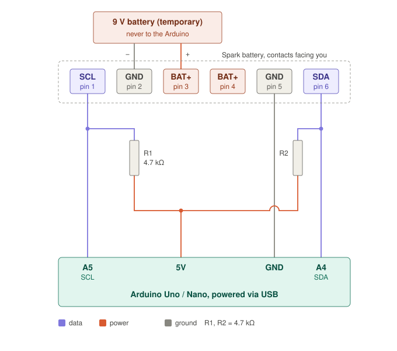

# dji-spark-battery-unbrick

Recuperación de baterías **DJI Spark** bloqueadas en *Permanent Fail* (PF) tras
pasar mucho tiempo descargadas, con un Arduino Uno/Nano y tres scripts de
bash para macOS. Probado con dos baterías reales (celdas entre 1,77 y 2,2 V):
**las dos se recuperaron** con la fuente de 12 V, `pf_pump.sh` y
`monitor_charge.sh`.



*English summary at the end.*

> **Seguridad.** Una celda Li-ion que ha estado por debajo de ~2 V puede tener
> daño interno y provocar un incendio al recargarse. No recuperes baterías
> hinchadas. Haz la primera carga al aire libre o sobre superficie no
> inflamable, sin perderla de vista. Uso bajo tu responsabilidad.

## Contenido

| Ruta | Qué es |
|---|---|
| `spark_unbrick/spark_unbrick.ino` | Sketch con menú por serie (115200): lectura, unseal, borrado de PF, reset, sellado, volcado CSV |
| `scripts/pf_pump.sh` | "Bombeo": repite unseal → borrar PF → reset hasta que la celda más baja supera el umbral y el BMS se queda precargando solo |
| `scripts/reset_pf.sh` | Recuperación de una sola ronda (para celdas ya por encima del umbral) |
| `scripts/monitor_charge.sh` | Monitor en pantalla fija (sin scroll): tensión por celda con barras, corriente, temperatura, PF y avisos; guarda CSV en `logs/` |
| `docs/monitor_charge.png` | Captura del monitor durante una precarga real |
| `docs/wiring_12v.svg` | Esquema con fuente de 12 V y 100 Ω (probado) |
| `docs/wiring_9v.svg` | Esquema con pila de 9 V (alternativa) |

## El problema

El BMS del Spark es un TI **BQ40Z307** con firmware DJI (serigrafiado
"BQ9003"), en la dirección SMBus `0x0B`. Si una celda baja del umbral de
*Safety Cell Undervoltage*, el chip registra un PF en su memoria flash y abre
los MOSFET de carga y descarga. La batería parece muerta y el cargador no la
acepta. El PF **no se borra solo** al subir la tensión: hay que borrarlo por
SMBus. Además, si las celdas siguen por debajo del umbral, **vuelve a saltar**
**a los 2–3 s del reset** (medido: con la celda más baja a 2,18 V, el PF
volvió a registrarse 3,3 s después del `DeviceReset`; el umbral parece rondar
los 2,2 V). Con celdas por debajo de ese umbral no da tiempo a llevar la
batería al cargador.

**Solución que ha funcionado: bombeo (`pf_pump.sh`).** Durante los 2–3 s que
el PF tarda en volver a saltar, el BMS precarga desde la fuente (~13 mA a
través de 100 Ω). Cada ronda unseal → `0x0029` → reset sube las celdas unos
6–10 mV. En la batería probada el PF dejó de saltar en la **ronda 3** (celda
más baja 2,20 V), con solo 2 escrituras extra de PF en la flash del BMS, y a
partir de ahí el BMS entró en precarga normal por sí solo (bit `PCHG` activo),
con todas sus protecciones activas. En unos minutos las celdas pasaron de
2,2 V a 2,7 V y el desequilibrio bajó de 207 a 33 mV. La segunda batería
necesitó lanzar `pf_pump.sh` unas 2–3 veces (con el antiguo límite de 30
rondas); por eso el límite por defecto es ahora 90.

## Hardware

- Arduino Uno o Nano (ATmega328P, 5 V)
- 2 × 4,7 kΩ (pull-ups de SDA y SCL a 5 V)
- Fuente de 9–12 V para alimentar el BMS dormido, con **100 Ω en serie** si no
  tiene limitación de corriente (el BMS consume pocos mA; la resistencia limita
  cualquier cortocircuito accidental)

### Opción A — fuente de 12 V con 100 Ω en serie (probada en este proyecto)

Es el montaje con el que se han recuperado las baterías de este repositorio:
Arduino Uno clónico, GND del Arduino en el pin 2 y la fuente de 12 V en los
pines 3 (+, a través de 100 Ω) y 5 (−).



### Opción B — pila de 9 V (alternativa, no probada aquí)

Montaje descrito por la comunidad: GND del Arduino en el pin 5 y la pila PP3
directamente en los pines 3 (+) y 2 (−). Una pila de 9 V no puede dar
corrientes peligrosas, por eso no lleva resistencia en serie.



Los pines 2 y 5 son las dos masas de la batería; compruébalo con el polímetro
(continuidad ≈ 0 Ω) antes de montar cualquiera de las dos opciones.

Conector de la batería, contactos mirando hacia ti, de izquierda a derecha:

```
  1     2     3     4     5     6
 SCL   GND   BAT+  BAT+  GND   SDA
```

| Batería | Arduino / fuente (opción A, probada) |
|---|---|
| 1 SCL | A5 (+ 4,7 kΩ a 5V) |
| 6 SDA | A4 (+ 4,7 kΩ a 5V) |
| 2 GND | GND del Arduino |
| 3 BAT+ | + de la fuente, a través de 100 Ω |
| 5 GND | − de la fuente |

El esquema de circuitschools (SDA=pin 5, SCL=pin 6) es para Mavic Air, **no**
para Spark.

## Uso

```bash
arduino-cli compile --fqbn arduino:avr:uno spark_unbrick
arduino-cli upload -p /dev/cu.usbserial-10 --fqbn arduino:avr:uno spark_unbrick
```

1. Conecta datos y fuente. Comprueba en el monitor serie (`S`, `W`, `T`, `I`)
   que el BMS responde y que el test de bus da **0 errores**.
2. Celda más baja por debajo de ~2,2 V: `./scripts/pf_pump.sh` → confirma →
   espera a `PF stays clear`. Por encima: `./scripts/reset_pf.sh`.
3. Deja la fuente conectada y vigila con `./scripts/monitor_charge.sh` mientras
   el BMS precarga.
4. Cuando la celda más baja esté holgadamente por encima del umbral (el monitor
   avisa a 3,0 V por defecto), quita la fuente y pon la batería en el cargador
   DJI. Vigila la primera carga completa.

`pf_pump.sh [max_rondas] [puerto]` — por defecto 90 rondas. Comprueba el bus
antes de escribir y pide confirmación (escribir `yes` si alguna celda < 2 V).
Termina solo en cuanto el PF deja de reactivarse (lo comprueba en reposo y
otra vez 10 s después: `PF stays clear`), o al agotar las rondas, o si la
temperatura supera 35 °C, falla el unseal o se pierde la comunicación. Cada
ronda en la que el PF vuelve a saltar es una escritura en la flash del BMS,
de resistencia limitada: si 90 rondas no bastan, mejor precargar las celdas
por fuera que seguir insistiendo.

`monitor_charge.sh [intervalo_s] [objetivo_mV] [puerto]` — por defecto 10 s,
3000 mV y `/dev/cu.usbserial-10`. Solo lee (comando `D`). Avisa con alarma si
la temperatura supera 40 °C, si el PF se reactiva o al alcanzar el objetivo.

Los scripts y la salida del sketch están en inglés.

### Menú del sketch

| Tecla | Acción | Escribe |
|---|---|---|
| `S` | Escanear I2C | no |
| `W` | Medir SDA/SCL (pull-ups, cortos) | no |
| `T` | 300 lecturas, cuenta errores | no |
| `I` | Estado completo | no |
| `D` | Una línea CSV (para el monitor) | no |
| `U` | Unseal (clave Spark, si falla TI por defecto) | sí |
| `F` | Full access (clave TI por defecto) | sí |
| `P` | `PermanentFailDataReset` (0x0029) con verificación | sí |
| `R` | `DeviceReset` (0x0041) | sí |
| `L` | Sellar (0x0030) | sí |
| `A` | U → P → R (dos rondas si hace falta) → L; pide confirmación si una celda < 2 V | sí |

## Notas de protocolo

- Clave de unseal Spark: `0xCCDF7EE0`, se escribe en `ManufacturerAccess`
  (0x00) como palabra baja `0x7EE0` y luego alta `0xCCDF`.
- Lecturas de estado: subcomando a `0x00` y respuesta en bloque desde
  `ManufacturerData` (0x23). `OperationStatus` (0x0054): `SEC` = bits 8–9
  (3 sellado, 2 unsealed, 1 full access), `PF` bit 12, `XDSG` 13, `XCHG` 14.
- Tras `DeviceReset` el chip vuelve sellado solo.

Diferencias con otros proyectos revisados: algunos leen el nivel de seguridad
del byte equivocado de la respuesta y tratan `SEC=1` como "unsealed", y envían
`0x002A`/`0x002B` como "PF clear", subcomandos que en el TRM de TI son otros
(reset del *black box* y LEDs). Aquí solo se usa `0x0029`.

## Créditos

- [o-gs/dji-firmware-tools#258](https://github.com/o-gs/dji-firmware-tools/issues/258):
  clave `0xCCDF7EE0` y secuencia `Unseal → PermanentFailDataReset → Seal` para Spark
- [Lishen99/DJI-Spark-Battery-Recovery-ESP32](https://github.com/Lishen99/DJI-Spark-Battery-Recovery-ESP32)
  y [lv70/spark-battery-nano](https://github.com/lv70/spark-battery-nano)
- [davext/unbrick-dji](https://github.com/davext/unbrick-dji)

---

## English summary

Arduino (Uno/Nano) sketch plus three macOS bash scripts to recover DJI Spark
batteries whose BQ40Z307 ("BQ9003") BMS latched Permanent Fail after deep
discharge. Unseal key `0xCCDF7EE0`, then `PermanentFailDataReset` (0x0029),
`DeviceReset`, seal.

If the lowest cell is below the undervoltage threshold (~2.2 V) the PF
re-latches 2-3 s after the reset. `pf_pump.sh` repeats unseal → clear → reset:
each short window lets the BMS precharge a few mV from the 12 V / 100 Ω supply.
On the tested pack the PF stopped re-latching after 3 rounds and the BMS then
kept precharging on its own with all protections active. `monitor_charge.sh`
shows a live, fixed-screen dashboard (screenshot above) and logs CSV. Wiring
option A (12 V supply through 100 Ω) is the one tested here.

Deeply discharged Li-ion cells are a fire risk: charge supervised, on a
non-flammable surface.

## Licencia

MIT. Ver [LICENSE](LICENSE).
