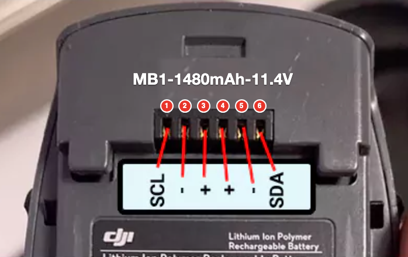

# dji-spark-battery-unbrick

Recover **DJI Spark** batteries stuck in *Permanent Fail* (PF) after sitting
discharged for a long time, using an Arduino Uno/Nano and three bash scripts
for macOS. Tested on two real packs (cells between 1.77 and 2.2 V): **both
were recovered** with the 12 V supply, `pf_pump.sh` and `monitor_charge.sh`.


> **Safety.** A Li-ion cell that has been below ~2 V may be internally damaged
> and can catch fire when recharged. Do not recover swollen packs. Do the
> first charge outdoors or on a non-flammable surface, and keep an eye on it.
> Use at your own risk.

## Contents

| Path | What it is |
|---|---|
| `spark_unbrick/spark_unbrick.ino` | Sketch with a serial menu (115200): status, unseal, PF clear, reset, seal, CSV dump |
| `scripts/pf_pump.sh` | "Pumping": repeats unseal → clear PF → reset until the lowest cell is above the threshold and the BMS keeps precharging on its own |
| `scripts/reset_pf.sh` | Single-round recovery (for cells already above the threshold) |
| `scripts/monitor_charge.sh` | Fixed-screen monitor (no scrolling): per-cell voltage bars, current, temperature, PF state and warnings; logs CSV to `logs/` |
| `docs/monitor_charge.png` | Screenshot of the monitor during a real precharge |
| `docs/wiring_12v.svg` | Wiring with a 12 V supply and 100 Ω (tested) |
| `docs/wiring_9v.svg` | Wiring with a 9 V battery (alternative) |
| `docs/spark_pinout.png` | Spark battery (MB1-1480mAh-11.4V) connector with pin numbers |

## The problem

The Spark BMS is a TI **BQ40Z307** running DJI firmware (marked "BQ9003"), at
SMBus address `0x0B`. When a cell drops below the *Safety Cell Undervoltage*
threshold, the chip latches a PF in its data flash and opens the charge and
discharge MOSFETs. The battery looks dead and the charger rejects it. The PF
**does not clear itself** when the voltage rises: it has to be cleared over
SMBus. And if the cells are still below the threshold, it **re-latches 2–3 s
after the reset** (measured: with the lowest cell at 2.18 V, the PF was logged
again 3.3 s after `DeviceReset`; the threshold appears to be about 2.2 V).
With cells below that threshold there is no time to move the battery to the
charger.

**What worked: pumping (`pf_pump.sh`).** During the 2–3 s before the PF
re-latches, the BMS precharges from the supply (~13 mA through 100 Ω). Each
unseal → `0x0029` → reset round lifts the cells by about 6–10 mV. On the tested
pack the PF stopped re-latching at **round 3** (lowest cell 2.20 V), with only
2 extra PF writes to the BMS flash. From then on the BMS entered normal
precharge by itself (`PCHG` bit set), with all its protections active. Within
minutes the cells went from 2.2 V to 2.7 V and the cell spread dropped from
207 to 33 mV. The second pack needed `pf_pump.sh` to be run about 2–3 times
(with the old 30-round limit), which is why the default limit is now 90.

## Hardware

- Arduino Uno or Nano (ATmega328P, 5 V)
- 2 × 4.7 kΩ (SDA and SCL pull-ups to 5 V)
- 9–12 V supply to power the sleeping BMS, with **100 Ω in series** if it is
  not current-limited (the BMS only draws a few mA; the resistor limits any
  accidental short)

### Option A — 12 V supply with 100 Ω in series (tested in this project)

This is the setup used to recover the batteries in this repository: a clone
Arduino Uno, Arduino GND on pin 2 and the 12 V supply on pins 3 (+, through
100 Ω) and 5 (−).


### Option B — 9 V battery (alternative, not tested here)

Setup described by the community: Arduino GND on pin 5 and a PP3 battery
directly on pins 3 (+) and 2 (−). A 9 V battery cannot deliver dangerous
currents, so it has no series resistor.


Pins 2 and 5 are the battery's two ground pins; check with a multimeter
(continuity ≈ 0 Ω) before building either option.

Battery connector, contacts facing you, left to right:



| Pin | 1 | 2 | 3 | 4 | 5 | 6 |
|:---:|:---:|:---:|:---:|:---:|:---:|:---:|
| **Signal** | SCL | GND | BAT+ | BAT+ | GND | SDA |

| Battery | Arduino / supply (option A, tested) |
|---|---|
| 1 SCL | A5 (+ 4.7 kΩ to 5V) |
| 6 SDA | A4 (+ 4.7 kΩ to 5V) |
| 2 GND | Arduino GND |
| 3 BAT+ | Supply +, through 100 Ω |
| 5 GND | Supply − |

## Software

Tested on macOS 26 with:

| Software | Version | Notes |
|---|---|---|
| [Homebrew](https://brew.sh) | — | Only used to install `arduino-cli` |
| [`arduino-cli`](https://arduino.github.io/arduino-cli/) | 1.5.1 | Compiles and uploads the sketch, serial monitor |
| Arduino AVR core (`arduino:avr`) | 1.8.8 | Board support for Uno/Nano; includes the `Wire` library used by the sketch |
| bash | 3.2 (macOS built-in) | The scripts only use built-in tools: `stty`, `tput`, `sed`, `date` |

No extra Arduino libraries are needed. Recent macOS versions include the
driver for the CH340 USB-serial chip used by most clone Uno/Nano boards; if no
port shows up, try another (data) USB cable before installing a driver.

Install:

```bash
brew install arduino-cli
arduino-cli core update-index
arduino-cli core install arduino:avr
```

Find the Arduino port (on this setup, `/dev/cu.usbserial-10`):

```bash
arduino-cli board list
```

The Arduino IDE also works instead of `arduino-cli`: open
`spark_unbrick/spark_unbrick.ino`, choose the board and port, upload, and use
its serial monitor at 115200 baud.

## Usage

Compile and upload the sketch (for a Nano use `arduino:avr:nano`; clones
may need `arduino:avr:nano:cpu=atmega328old`):

```bash
arduino-cli compile --fqbn arduino:avr:uno spark_unbrick
arduino-cli upload -p /dev/cu.usbserial-10 --fqbn arduino:avr:uno spark_unbrick
```

Open the serial monitor (type the menu keys and press Enter; Ctrl-C to exit):

```bash
arduino-cli monitor -p /dev/cu.usbserial-10 -c baudrate=115200
```

All scripts take the port as their last argument if it is not
`/dev/cu.usbserial-10`. Close the serial monitor before running a script:
only one program can use the port at a time.

1. Connect the data lines and the supply. In the serial monitor (`S`, `W`,
   `T`, `I`) check that the BMS answers and that the bus test reports
   **0 errors**.
2. Lowest cell below ~2.2 V: `./scripts/pf_pump.sh` → confirm → wait for
   `PF stays clear`. Above it: `./scripts/reset_pf.sh`.
3. Leave the supply connected and watch with `./scripts/monitor_charge.sh`
   while the BMS precharges.
4. Once the lowest cell is comfortably above the threshold (the monitor alerts
   at 3.0 V by default), remove the supply and put the battery on the DJI
   charger. Supervise the whole first charge.

`pf_pump.sh [max_rounds] [port]` — 90 rounds by default. It checks the bus
before writing and asks for confirmation (type `yes` if any cell is < 2 V). It
stops by itself as soon as the PF no longer re-latches (checked at rest and
again 10 s later: `PF stays clear`), or when the rounds run out, or if the
temperature exceeds 35 °C, the unseal fails or communication is lost. Every
round in which the PF re-latches is a write to the BMS flash, which has
limited endurance: if 90 rounds are not enough, precharge the cells directly
instead of insisting.

`monitor_charge.sh [interval_s] [target_mV] [port]` — 10 s, 3000 mV and
`/dev/cu.usbserial-10` by default. Read-only (`D` command). It raises an alarm
if the temperature exceeds 40 °C, if the PF re-latches, or when the target is
reached.

### Sketch menu

| Key | Action | Writes |
|---|---|---|
| `S` | Scan I2C | no |
| `W` | Measure SDA/SCL (pull-ups, shorts) | no |
| `T` | 300 reads, counts errors | no |
| `I` | Full status | no |
| `D` | One CSV line (for the monitor) | no |
| `U` | Unseal (Spark key, TI default as fallback) | yes |
| `F` | Full access (TI default key) | yes |
| `P` | `PermanentFailDataReset` (0x0029) with verification | yes |
| `R` | `DeviceReset` (0x0041) | yes |
| `L` | Seal (0x0030) | yes |
| `A` | U → P → R (two rounds if needed) → L; asks for confirmation if a cell is < 2 V | yes |

## Protocol notes

- Spark unseal key: `0xCCDF7EE0`, written to `ManufacturerAccess` (0x00) as
  the low word `0x7EE0` followed by the high word `0xCCDF`.
- Status reads: subcommand to `0x00` and block response from
  `ManufacturerData` (0x23). `OperationStatus` (0x0054): `SEC` = bits 8–9
  (3 sealed, 2 unsealed, 1 full access), `PF` bit 12, `XDSG` 13, `XCHG` 14.
- After `DeviceReset` the chip comes back sealed on its own.

Differences from other projects reviewed: some read the security level from
the wrong byte of the response and treat `SEC=1` as "unsealed", and they send
`0x002A`/`0x002B` as "PF clear", subcommands that the TI TRM defines as
something else (black box reset and LEDs). Only `0x0029` is used here.

## Credits

- [o-gs/dji-firmware-tools#258](https://github.com/o-gs/dji-firmware-tools/issues/258):
  `0xCCDF7EE0` key and the `Unseal → PermanentFailDataReset → Seal` sequence for the Spark
- [Lishen99/DJI-Spark-Battery-Recovery-ESP32](https://github.com/Lishen99/DJI-Spark-Battery-Recovery-ESP32)
  and [lv70/spark-battery-nano](https://github.com/lv70/spark-battery-nano)
- [davext/unbrick-dji](https://github.com/davext/unbrick-dji)

## License

MIT. See [LICENSE](LICENSE).
